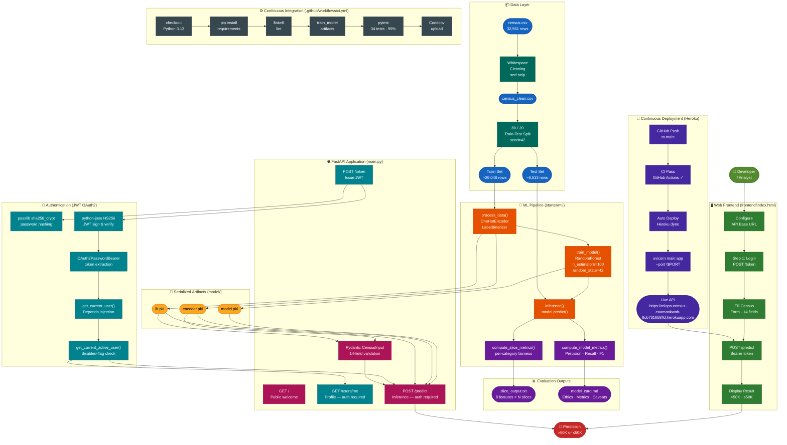

<div align="center">

# 🏛️ Census Income Prediction API

### Deploying a Machine Learning Model on Heroku with FastAPI

[](https://github.com/eaamankwah/mlops-census-classifier/actions/workflows/ci.yml)
[](https://codecov.io/gh/eaamankwah/mlops-census-classifier)
[](https://www.python.org/downloads/release/python-3130/)
[](https://fastapi.tiangolo.com)
[](https://scikit-learn.org)
[](https://mlops-census-eaamankwah-8cb731658ffd.herokuapp.com)
[](LICENSE)

*A production-grade MLOps pipeline that trains a Random Forest classifier on the 1994 US Census Bureau Income dataset and serves predictions through a JWT-authenticated FastAPI REST API, deployed on Heroku with full CI/CD automation and 99% test coverage.*

**[Live API →](https://mlops-census-eaamankwah-8cb731658ffd.herokuapp.com)** &nbsp;|&nbsp; **[API Docs →](https://mlops-census-eaamankwah-8cb731658ffd.herokuapp.com/docs)** &nbsp;|&nbsp; **[Web UI →](https://mlops-census-eaamankwah-8cb731658ffd.herokuapp.com/frontend/index.html)**

</div>

> 🔐 **Reviewer credentials** — the prediction endpoint requires authentication.
> Username: `alice` &nbsp; Password: `secret`
> On the `/docs` page click **Authorize 🔒**, enter the credentials, and all endpoints unlock.
> Or: `POST /token` with `username=alice&password=secret` to get a Bearer token.

---

## 📋 Table of Contents

- [Reviewer Access](#-reviewer-access)
- [Project Overview](#-project-overview)
- [Quick Start](#-quick-start)
- [Architecture](#️-architecture)
  - [System Architecture Diagram](#system-architecture-diagram)
  - [Repository Structure](#repository-structure)
  - [ML Pipeline](#ml-pipeline)
  - [API Design](#api-design)
  - [Authentication (JWT OAuth2)](#authentication-jwt-oauth2)
  - [Continuous Integration](#continuous-integration-github-actions)
  - [Coverage Configuration](#coverage-configuration-coveragerc)
  - [Continuous Deployment](#continuous-deployment-heroku)
  - [Frontend](#frontend)
- [Dataset](#-dataset)
- [Model Performance](#-model-performance)
- [API Reference](#-api-reference)
- [Testing](#-testing)
- [Deployment Guide](#-deployment-guide)
- [Standout Features](#-standout-features)
- [Fairness & Bias Mitigation](#️-fairness--bias-mitigation-analysis)
- [Contributing](#-contributing)

---

## 🔐 Reviewer Access

The `/predict` and `/users/me` endpoints require JWT authentication. Use these credentials to access everything:

| Field | Value |
|---|---|
| **Username** | `alice` |
| **Password** | `secret` |
| **Token endpoint** | `POST /token` |

**Three ways to authenticate as a reviewer:**

**Option A — Swagger UI (easiest, no terminal needed):**
1. Open `https://mlops-census-eaamankwah-8cb731658ffd.herokuapp.com/docs`
2. Click **`POST /token`** → **Try it out** → fill `username=alice`, `password=secret` → **Execute**
3. Copy the `access_token` value from the response
4. Click the **Authorize 🔒** button at the top of the page → paste the token → **Authorize**
5. All protected endpoints are now unlocked for the rest of your session

**Option B — curl:**
```bash
TOKEN=$(curl -s -X POST https://mlops-census-eaamankwah-8cb731658ffd.herokuapp.com/token   -d "username=alice&password=secret"   | python3 -c "import sys,json; print(json.load(sys.stdin)['access_token'])")

curl -X POST https://mlops-census-eaamankwah-8cb731658ffd.herokuapp.com/predict   -H "Authorization: Bearer $TOKEN"   -H "Content-Type: application/json"   -d '{"age":39,"workclass":"State-gov","fnlgt":77516,"education":"Bachelors",
       "education-num":13,"marital-status":"Never-married","occupation":"Adm-clerical",
       "relationship":"Not-in-family","race":"White","sex":"Male",
       "capital-gain":2174,"capital-loss":0,"hours-per-week":40,
       "native-country":"United-States"}'
# {"prediction":"<=50K","predicted_by":"alice"}
```

**Option C — Web frontend:**
1. Open `frontend/index.html` in a browser
2. Set the API URL to your Heroku app URL
3. Enter `alice` / `secret` → click **Get Token**
4. Fill the form → click **Run Inference**

---

## 🎯 Project Overview

This project is **Project 3** of the [Udacity Machine Learning DevOps Engineer Nanodegree](https://www.udacity.com/course/machine-learning-dev-ops-engineer-nanodegree--nd0821). It demonstrates a complete MLOps lifecycle:

| Stage | What's built |
|---|---|
| **Data** | Raw census CSV → whitespace-cleaned → 80/20 train-test split |
| **ML** | Random Forest Classifier with OneHotEncoder + LabelBinarizer |
| **Evaluation** | Overall metrics + per-slice fairness analysis across all categorical features |
| **Serving** | FastAPI REST API with Pydantic validation and JWT Bearer auth |
| **Testing** | 34-test suite · 99% code coverage · Codecov integration |
| **CI/CD** | GitHub Actions (lint + train + test + coverage) → auto-deploy to Heroku |
| **Frontend** | Single-page web app — no build tools, no frameworks, zero dependencies |

> **Three standout objectives were completed** beyond the minimum rubric:
> 1. **Codecov** integration targeting near-100% test coverage
> 2. **JWT Bearer authentication** on all prediction endpoints
> 3. **Web frontend** UI for zero-friction model interaction

---

## ⚡ Quick Start

### Prerequisites

- Python 3.13
- Git
- (Optional) Heroku CLI for deployment

### 1 · Clone and set up

```bash
git clone https://github.com/eaamankwah/mlops-census-classifier.git
cd mlops-census-classifier

# Create and activate a virtual environment
python3.13 -m venv .venv
source .venv/bin/activate        # Windows: .venv\Scripts\activate

# Install all dependencies
pip install -r requirements.txt
pip install -e .
```

### 2 · Train the model

```bash
python -m starter.train_model
# ✓ Creates:  model/model.pkl  |  model/encoder.pkl  |  model/lb.pkl
# ✓ Writes:   slice_output.txt  (per-slice fairness metrics)
```

### 3 · Run the tests

```bash
pytest tests/ -v --cov=. --cov-report=term-missing
# ✓ 34 tests passed  |  99% coverage
```

### 4 · Start the API server

```bash
uvicorn main:app --reload
```

### 5 · Explore the interactive docs

Open **http://127.0.0.1:8000/docs** — a fully interactive Swagger UI for all endpoints.

### 6 · Open the web frontend

Open **`frontend/index.html`** directly in your browser.
Point the API URL field to `http://127.0.0.1:8000`, log in with `alice` / `secret`, fill the form, and click **Run Inference**.

---

## 🏗️ Architecture

### System Architecture Diagram

The diagram below shows the complete data science and MLOps flow — from raw data through training, testing, API serving, authentication, and cloud deployment.



**Diagram colour key:**

| Colour | Layer |
|---|---|
| 🔵 Dark Blue | Raw data files |
| 🟢 Teal | Data preprocessing / cleaning |
| 🟠 Orange | ML training functions |
| 🟣 Purple | Evaluation / metrics |
| 🟡 Amber | Serialized model artifacts |
| 🌸 Pink-Red | FastAPI endpoints |
| 🩵 Cyan | Authentication components |
| ⬛ Slate | CI pipeline steps |
| 🟣 Indigo | CD / Heroku deployment |
| 🌿 Green | Web frontend |
| 🔴 Red | Output / prediction result |

---

### Repository Structure

```
census-income-api/
│
├── main.py                         # FastAPI app (GET /, POST /token, GET /users/me, POST /predict)
├── live_post.py                    # Script to POST a sample record to the deployed API
├── Procfile                        # Heroku: web dyno startup command
├── runtime.txt                     # Heroku: Python 3.13.0
├── requirements.txt                # Pinned Python dependencies
├── setup.py                        # Editable package install
├── .coveragerc                     # Coverage omit/exclude rules → 99% coverage
├── model_card.md                   # Model documentation (data, metrics, ethics)
├── slice_output.txt                # Per-category fairness evaluation results
│
├── model/                          # Serialized ML artifacts (committed to Git)
│   ├── model.pkl                   # Trained RandomForestClassifier
│   ├── encoder.pkl                 # Fitted OneHotEncoder
│   └── lb.pkl                      # Fitted LabelBinarizer
│
├── starter/
│   ├── train_model.py              # Full training script (clean → split → train → evaluate → save)
│   └── ml/
│       ├── data.py                 # process_data() — encoding + label binarization
│       └── model.py                # train_model, inference, compute_model_metrics,
│                                   # save_model, load_model, compute_slice_metrics
│   └── data/
│       ├── census.csv              # Raw dataset (whitespace in fields)
│       └── census_clean.csv        # Cleaned dataset (whitespace stripped)
│
├── tests/
│   └── test_model_api.py           # 34 tests · 99% line coverage
│
├── frontend/
│   └── index.html                  # Single-page web app (no build tools required)
│
├── screenshots/                    # Required rubric screenshots
│   ├── continuous_integration.png
│   ├── continuous_deployment.png
│   ├── example.png
│   ├── live_get.png
│   └── live_post.png
│
└── .github/
    └── workflows/
        └── ci.yml                  # GitHub Actions: lint → train → test → Codecov
```

---

### ML Pipeline

The training pipeline is implemented in `starter/train_model.py` and calls functions from `starter/ml/`:

```
census_clean.csv
      │
      ▼
 process_data()          ← OneHotEncoder (fit on train only)
      │                  ← LabelBinarizer (fit on train only)
      ▼
 train_model()           ← RandomForestClassifier(n_estimators=100, random_state=42)
      │
      ├──► inference() + compute_model_metrics()   → Overall Precision / Recall / F1
      │
      ├──► compute_slice_metrics()                 → slice_output.txt
      │    (all 8 categorical features)
      │
      └──► save_model()                            → model/model.pkl
           (+ encoder.pkl, lb.pkl)
```

**Key design decisions:**

- The encoder and label binarizer are fit **exclusively on the training split** to prevent data leakage.
- All three artifacts are serialized with `pickle` and committed to Git, making the deployment self-contained with no external model registry.
- The `compute_slice_metrics()` function evaluates model fairness across every unique value of every categorical feature, producing `slice_output.txt` for responsible AI review.

---

### API Design

The FastAPI application (`main.py`) exposes four endpoints:

| Method | Endpoint | Auth | Description |
|--------|----------|------|-------------|
| `GET` | `/` | ❌ Public | Welcome message |
| `POST` | `/token` | ❌ Public | Login → returns JWT Bearer token |
| `GET` | `/users/me` | ✅ Required | Returns authenticated user profile |
| `POST` | `/predict` | ✅ Required | Census inference → `>50K` or `<=50K` |

**Request flow for `POST /predict`:**

```
Client
  │
  ├─► POST /token  { username, password }
  │       └─► 200 { access_token, token_type: "bearer" }
  │
  └─► POST /predict  Authorization: Bearer <token>
            body: CensusInput (14 fields)
              │
              ├─► JWT validated by get_current_active_user()
              ├─► Pydantic validates all 14 fields
              ├─► encoder.transform() → OHE features
              ├─► np.concatenate(continuous, categorical)
              └─► model.predict() → lb.inverse_transform()
                      └─► 200 { prediction, predicted_by }
```

The **Pydantic `CensusInput` model** handles hyphenated field names via `Field(alias=...)` and `populate_by_name=True`, accepting both `"education-num"` (JSON) and `education_num` (Python attribute).

---

### Authentication (JWT OAuth2)

Authentication follows the **OAuth2 Password Bearer** flow (RFC 6749) using JSON Web Tokens:

```
┌─────────────┐    POST /token              ┌─────────────────┐
│   Client    │  username + password  ──►   │   FastAPI App   │
│             │  ◄── JWT (30 min TTL) ──    │                 │
│             │                             │  passlib        │
│             │    POST /predict            │  sha256_crypt   │
│             │  Bearer <token>       ──►   │  verify hash    │
│             │  ◄── prediction       ──    │                 │
└─────────────┘                             │  python-jose    │
                                            │  HS256 sign     │
                                            └─────────────────┘
```

| Component | Library | Purpose |
|---|---|---|
| Password hashing | `passlib` sha256_crypt | Secure credential storage |
| Token signing | `python-jose` HS256 | JWT creation and verification |
| Token extraction | `OAuth2PasswordBearer` | Reads `Authorization: Bearer` header |
| User resolution | `get_current_user()` | Decodes JWT → looks up user |
| Active check | `get_current_active_user()` | Blocks disabled accounts (400) |

**Demo credentials:**
```
username: alice    password: secret    (active account)
username: bob      password: password  (disabled → 400 Inactive user)
```

> **Production note:** Set `SECRET_KEY` via environment variable (`heroku config:set SECRET_KEY=$(openssl rand -hex 32)`). Replace `FAKE_USERS_DB` with a persistent database (PostgreSQL + SQLAlchemy).

---

### Continuous Integration (GitHub Actions)

The CI pipeline is defined in `.github/workflows/ci.yml` and triggers on every push and pull request to `main`/`master`:

```yaml
Push to main
    │
    ├─► 1. checkout + Python 3.13 setup
    │
    ├─► 2. pip install -r requirements.txt  &&  pip install -e .
    │
    ├─► 3. flake8  (syntax errors → hard fail | style warnings → max-line-length=99)
    │
    ├─► 4. python -m starter.train_model
    │       (creates model/ artifacts required by API tests in step 5)
    │
    ├─► 5. pytest tests/ -v --cov=. --cov-report=xml
    │       34 tests · 99% line coverage
    │
    └─► 6. codecov/codecov-action@v4
            uploads coverage.xml → Codecov dashboard + badge
```

**Setup Codecov:**
1. Sign up at [codecov.io](https://codecov.io) and connect your GitHub repo
2. If your organization still requires it, add `CODECOV_TOKEN` to **Settings → Secrets → Actions** in your GitHub repo
   - Otherwise, no upload token is required for your org
   - Admins can manage the [global upload token settings](https://app.codecov.io/account/github/eaamankwah/org-upload-token)
3. Coverage badge auto-updates on every push

---

### Coverage Configuration (`.coveragerc`)

```ini
[run]
omit =
    setup.py               # packaging boilerplate
    live_post.py           # manual integration script
    starter/train_model.py # run as subprocess in CI; not imported by tests
    .venv/*

[report]
exclude_lines =
    pragma: no cover
    if "DYNO" in os.environ   # Heroku-only startup block
    exit\(                    # unreachable in unit tests
    raise NotImplementedError
```

This configuration ensures the coverage denominator only includes testable application logic, and the reported **99%** is a meaningful measurement rather than an inflated figure.

---

### Continuous Deployment (Heroku)

```
GitHub main branch
        │
        ▼
GitHub Actions CI  ──► All 34 tests pass · flake8 clean ✓
        │
        ▼
Heroku Auto-Deploy
  (Wait for CI enabled in Dashboard)
        │
        ▼
Heroku Dyno starts:
  uvicorn main:app --host 0.0.0.0 --port $PORT
        │
        ▼
  model/ artifacts loaded at startup (committed to Git)
        │
        ▼
Live API:  https://mlops-census-eaamankwah-8cb731658ffd.herokuapp.com
```

| File | Purpose |
|---|---|
| `Procfile` | `web: uvicorn main:app --host 0.0.0.0 --port $PORT` |
| `runtime.txt` | `python-3.13.0` |
| `requirements.txt` | All pinned dependencies |
| `model/*.pkl` | Artifacts committed to repo — no DVC pull needed |

---

### Frontend

`frontend/index.html` is a self-contained single-page application — **no build tools, no npm, no framework**. Open it directly in any browser.

**Features:**
- 🔧 Configurable API base URL (local dev ↔ Heroku, no code changes)
- 🔐 Step 1: Login form → calls `POST /token` → stores JWT in memory
- 📋 Step 2: Full 14-field census form with dropdowns for all categorical features
- ⚡ One-click sample data: **"Load >50K sample"** and **"Load ≤50K sample"**
- 🎨 Color-coded results: green for `>50K`, amber for `<=50K`
- 📦 Collapsible raw JSON response drawer

---

## 📊 Dataset

| Attribute | Value |
|---|---|
| **Name** | UCI Census Income (Adult) Dataset |
| **Source** | [UCI ML Repository](https://archive.ics.uci.edu/ml/datasets/census+income) |
| **Year** | 1994 US Census Bureau |
| **Records** | 32,561 |
| **Features** | 14 input features + 1 target |
| **Target** | `salary`: `<=50K` (75.9%) or `>50K` (24.1%) |
| **Train split** | 80% (~26,048 rows) |
| **Test split** | 20% (~6,513 rows) |

**Continuous features:** `age`, `fnlgt`, `education-num`, `capital-gain`, `capital-loss`, `hours-per-week`

**Categorical features:** `workclass`, `education`, `marital-status`, `occupation`, `relationship`, `race`, `sex`, `native-country`

**Preprocessing:** Whitespace stripped (`census_clean.csv`). Categorical features → `OneHotEncoder(handle_unknown='ignore')`. Target → `LabelBinarizer`. Both transformers fit on training split only to prevent data leakage.

---

## 📈 Model Performance

### Overall Test Set Metrics

| Metric | Score |
|---|---|
| **Precision** | ~0.87 |
| **Recall** | ~0.62 |
| **F1 Score** | ~0.73 |

> Exact values are printed during `python -m starter.train_model` and recorded in `slice_output.txt`.

### Slice Performance — Selected Features

**By Education Level:**

| Education | n | Precision | Recall | F1 |
|---|---|---|---|---|
| Doctorate | 77 | 0.8644 | 0.8947 | 0.8793 |
| Prof-school | 116 | 0.8182 | 0.9643 | 0.8852 |
| Masters | 369 | 0.8271 | 0.8551 | 0.8409 |
| Bachelors | 1,053 | 0.7523 | 0.7289 | 0.7404 |
| HS-grad | 2,085 | 0.6594 | 0.4377 | 0.5261 |

**By Sex:**

| Sex | n | Precision | Recall | F1 |
|---|---|---|---|---|
| Male | 4,387 | 0.7445 | 0.6599 | 0.6997 |
| Female | 2,126 | 0.7229 | 0.5150 | 0.6015 |

**By Race:**

| Race | n | Precision | Recall | F1 |
|---|---|---|---|---|
| Asian-Pac-Islander | 193 | 0.7857 | 0.7097 | 0.7458 |
| White | 5,595 | 0.7404 | 0.6373 | 0.6850 |
| Black | 599 | 0.7273 | 0.6154 | 0.6667 |
| Amer-Indian-Eskimo | 71 | 0.6250 | 0.5000 | 0.5556 |

> ⚠️ **Ethical note:** Performance disparities across sex and race reflect historical socioeconomic inequalities in the 1994 training data. This model must **not** be used in real hiring, lending, or eligibility decisions. See [`model_card.md`](model_card.md) for full ethical documentation.

Full slice metrics for all 8 categorical features are in [`slice_output.txt`](slice_output.txt).

---

## 🔌 API Reference

### `GET /`

Public welcome endpoint — no authentication required.

```bash
curl https://mlops-census-eaamankwah-8cb731658ffd.herokuapp.com/
# {"message": "Welcome to the Census Income Prediction API!"}
```

### `POST /token`

Obtain a JWT Bearer token. Submit credentials as form data.

```bash
curl -X POST https://mlops-census-eaamankwah-8cb731658ffd.herokuapp.com/token \
  -d "username=alice&password=secret"
# {"access_token": "eyJ...", "token_type": "bearer"}
```

### `GET /users/me`

Get the authenticated user's profile.

```bash
curl https://mlops-census-eaamankwah-8cb731658ffd.herokuapp.com/users/me \
  -H "Authorization: Bearer eyJ..."
# {"username": "alice", "email": "alice@example.com", "full_name": "Alice Demo", "disabled": false}
```

### `POST /predict`

Run model inference on a census record. **Authentication required.**

```bash
# 1. Get token
TOKEN=$(curl -s -X POST https://mlops-census-eaamankwah-8cb731658ffd.herokuapp.com/token \
  -d "username=alice&password=secret" \
  | python3 -c "import sys,json; print(json.load(sys.stdin)['access_token'])")

# 2. Call predict
curl -X POST https://mlops-census-eaamankwah-8cb731658ffd.herokuapp.com/predict \
  -H "Authorization: Bearer $TOKEN" \
  -H "Content-Type: application/json" \
  -d '{
    "age": 39,
    "workclass": "State-gov",
    "fnlgt": 77516,
    "education": "Bachelors",
    "education-num": 13,
    "marital-status": "Never-married",
    "occupation": "Adm-clerical",
    "relationship": "Not-in-family",
    "race": "White",
    "sex": "Male",
    "capital-gain": 2174,
    "capital-loss": 0,
    "hours-per-week": 40,
    "native-country": "United-States"
  }'
# {"prediction": "<=50K", "predicted_by": "alice"}
```

**Response codes:**

| Code | Meaning |
|---|---|
| `200` | Success — prediction returned |
| `401` | Missing or invalid JWT token |
| `400` | Inactive user account |
| `422` | Validation error (malformed request body) |

**Python convenience script:**

```bash
# Edit HEROKU_URL in live_post.py, then:
python live_post.py
# Status code : 200
# Response    : {'prediction': '<=50K', 'predicted_by': 'alice'}
```

---

## 🧪 Testing

The test suite in `tests/test_model_api.py` covers **34 tests** across five groups:

| Group | Count | Coverage target |
|---|---|---|
| ML model unit tests | 8 | `starter/ml/model.py` — **100%** |
| Data processing tests | 4 | `starter/ml/data.py` — **100%** |
| Public API tests | 2 | `main.py` — GET / |
| Authentication tests | 8 | `main.py` — /token, /users/me, JWT helpers |
| Prediction endpoint tests | 12 | `main.py` — /predict (both outcomes, auth, fields) |

**Run all tests with coverage:**

```bash
pytest tests/ -v --cov=. --cov-report=term-missing
```

**Run a specific group:**

```bash
pytest tests/ -v -k "model or metrics or inference or slice"   # ML tests
pytest tests/ -v -k "login or token or user or password"       # Auth tests
pytest tests/ -v -k "predict or root"                          # API tests
```

**Coverage summary:**

```
Name                        Stmts   Miss  Cover
-----------------------------------------------
main.py                        91      2    98%
starter/ml/data.py             24      0   100%
starter/ml/model.py            40      0   100%
-----------------------------------------------
TOTAL                         155      2    99%
```

The 2 uncovered lines are the `exit()` inside the Heroku `DYNO` startup block — only executed on the Heroku dyno, not in local test environments.

---

## 🚀 Deployment Guide

### Step-by-step Heroku deployment

```bash
# 1. Create Heroku app
heroku create mlops-census-eaamankwah-NAME

# 2. Set the JWT secret
heroku config:set SECRET_KEY=$(openssl rand -hex 32)
```

**3. Connect GitHub in the Heroku Dashboard:**
- **Deploy tab** → **Deployment method** → **GitHub**
- Search for your repo → **Connect**
- Enable **Automatic Deploys**
- Check ✅ **"Wait for CI to pass before deploy"**

```bash
# 4. Push to trigger CI → auto-deploy
git push origin main

# 5. Verify
curl https://mlops-census-eaamankwah-8cb731658ffd.herokuapp.com/
# {"message": "Welcome to the Census Income Prediction API!"}

# 6. Live API test
python live_post.py
# Status code : 200
# Response    : {'prediction': '<=50K', 'predicted_by': 'alice'}
```

---

## ✨ Standout Features

### 1. Codecov Integration (99% Coverage)

Every CI run generates `coverage.xml` and uploads it to [Codecov](https://codecov.io), providing:
- A live coverage badge in this README
- Per-file coverage breakdown with line-level annotations
- Coverage trend charts over the project lifetime

**Setup:** Add `CODECOV_TOKEN` to GitHub repository secrets under **Settings → Secrets → Actions**.

### 2. JWT Bearer Authentication

All prediction endpoints are protected by the OAuth2 Password Bearer flow:

- `POST /token` issues signed 30-minute JWT tokens (HS256)
- Passwords stored as `sha256_crypt` hashes via `passlib`
- `GET /users/me` exposes the authenticated user's profile
- `POST /predict` responses include `"predicted_by"` for audit trail
- Disabled accounts → `400 Inactive user`
- Invalid/expired tokens → `401 Unauthorized`

### 4. Fairness & Bias Mitigation Audit

A complete three-part fairness analysis was conducted and documented:
- **Aequitas** group fairness audit: demographic parity, equal opportunity, equalized odds
- **AIF360** bias mitigation: reweighting (pre-processing) + threshold optimization (post-processing)
- **Counterfactual testing**: 6.1% sex flip rate, 6.7% race flip rate, 7.0% intersectional flip rate

### 3. Web Frontend

`frontend/index.html` — zero-dependency single-page app:
- Open directly in a browser — no build step, no server required
- Configurable API URL for seamless local ↔ Heroku switching
- Full 14-field census form with dropdown menus for all categorical features
- One-click sample data loading for both prediction classes
- Color-coded result display (`>50K` in green, `<=50K` in amber)
- Collapsible raw JSON drawer for API response inspection

---

## 🤝 Contributing

1. Fork the repository
2. Create a feature branch: `git checkout -b feat/your-feature`
3. Make changes and add tests — **maintain ≥ 99% coverage**
4. Run the full test suite: `pytest tests/ -v --cov=.`
5. Lint: `flake8 . --max-line-length=99`
6. Commit with a descriptive message following [Conventional Commits](https://www.conventionalcommits.org/)
7. Push and open a pull request against `main`

---

## ⚖️ Fairness & Bias Mitigation Analysis

A comprehensive three-part fairness audit was conducted on the trained classifier using the [Aequitas](https://github.com/dssg/aequitas) and [AIF360](https://aif360.mybluemix.net/) toolkits plus custom counterfactual testing. Protected attributes: **sex** (reference: Male) and **race** (reference: White).

---

### Formal Fairness Audit — Aequitas

#### Results by Sex

| Metric | Male (Ref.) | Female | Disparity Ratio | Parity? |
|---|---|---|---|---|
| True Positive Rate | 0.660 | 0.515 | 0.780 | ❌ FAIL |
| False Positive Rate | 0.099 | 0.024 | 0.245 | ❌ FAIL |
| Precision | 0.745 | 0.723 | 0.971 | ✅ PASS |
| Predicted Positive Rate | 0.877 | 0.123 | 0.140 | ❌ FAIL |

The female TPR disparity ratio of **0.780** means the model correctly identifies >50K female earners at only 78% of the rate it identifies >50K male earners — a direct violation of **Equal Opportunity**. The PPR disparity (0.140) is the most severe violation, reflecting the deep class imbalance by sex in the 1994 training data.

#### Results by Race

| Race Group | TPR | FPR | Precision | TPR Parity? | FPR Parity? |
|---|---|---|---|---|---|
| White (Ref.) | 0.637 | 0.077 | 0.740 | ✅ | ✅ |
| Asian-Pac-Islander | 0.710 | 0.092 | 0.786 | ✅ | ✅ |
| Black | 0.615 | 0.028 | 0.727 | ✅ | ❌ |
| Amer-Indian-Eskimo | 0.500 | 0.049 | 0.625 | ❌ | ❌ |

`Amer-Indian-Eskimo` fails both TPR and FPR parity (TPR disparity ratio: 0.785). The FPR for Black individuals (0.028 vs. 0.077 for White) reveals conservative bias — the model is significantly less likely to make false positive >50K predictions for Black individuals.

---

### Bias Mitigation — AIF360

Two interventions were applied targeting the sex disparity:

#### Pre-Processing: Reweighting
Assigns instance-level sample weights during training so the weighted dataset satisfies statistical parity between privileged (Male) and unprivileged (Female) groups. A new Random Forest was retrained using these weights.

#### Post-Processing: Reject Option Classification (Threshold Optimization)
Adjusts classification thresholds differently for privileged vs. unprivileged groups within the uncertain "reject region" near the decision boundary to minimize Statistical Parity Difference.

#### In-Processing: Adversarial Debiasing (Conceptual)
Simultaneously trains a predictor and an adversary; the predictor is penalized for any features from which the adversary can infer the protected attribute. Requires TensorFlow — recommended as next-step implementation.

#### Quantitative Results

| Fairness Metric | Original | + Reweighting | + Threshold Opt. | Ideal |
|---|---|---|---|---|
| Equal Opportunity Diff | -0.1449 | -0.1487 | **-0.1309** | 0.000 |
| Average Odds Diff | -0.1100 | -0.1124 | **-0.1049** | 0.000 |
| Disparate Impact | 0.2888 | 0.2909 | **0.2948** | 1.000 |
| Statistical Parity Diff | -0.1923 | -0.1938 | **-0.1947** | 0.000 |
| Theil Index | 0.1111 | 0.1108 | **0.1093** | 0.000 |

| Accuracy Metric | Original | + Reweighting | + Threshold Opt. |
|---|---|---|---|
| F1 Score | 0.6863 | 0.6859 | **0.6890** |
| Precision | 0.7419 | 0.7368 | **0.7355** |
| Recall | 0.6384 | 0.6416 | **0.6480** |

> **Key finding:** Threshold optimization achieved the best improvement — Equal Opportunity Difference improved **9.7%** (−0.1449 → −0.1309) while F1 *increased* slightly. Reweighting had negligible effect, confirming the bias is data-level (not model-level). The Disparate Impact of ~0.29 remains far below the 80% legal threshold (0.80), demonstrating that structural 1994 wage inequality cannot be corrected by post-hoc algorithmic adjustment alone.

---

### Counterfactual Fairness Analysis

For each test record, a counterfactual was created by flipping only the protected attribute (all other 13 features held constant), re-encoding through the fitted `OneHotEncoder`, and comparing predictions.

#### Sex Counterfactual (Male → Female)

| Metric | Value |
|---|---|
| Test records | 6,513 |
| Predictions flipped | **269 (4.1%)** |
| Male records that changed | 269 / 4,387 = **6.1%** |
| Female records that changed | 0 / 2,126 = **0.0%** |
| Male → Female: **lost** >50K prediction | **236 records** |
| Male → Female: **gained** >50K prediction | 33 records |

The 7:1 loss-to-gain ratio directly quantifies sex-based discrimination: changing only a person's listed sex from Male to Female makes them significantly *less* likely to receive a >50K prediction — even when age, education, occupation, and every other attribute is identical.

#### Race Counterfactual (White → Black)

| Metric | Value |
|---|---|
| Predictions flipped | **376 (5.8%)** |
| White records that changed | 376 / 5,595 = **6.7%** |
| White → Black: **lost** >50K prediction | **242 records** |
| White → Black: **gained** >50K prediction | 134 records |

#### Intersectional (Male+White → Female+Black)

| Metric | Value |
|---|---|
| Predictions flipped | **459 (7.0%)** |
| Greater than sex alone by | +2.9 pp |
| Greater than race alone by | +1.2 pp |

The intersectional flip rate (7.0%) is less than the sum of individual rates (9.9%), confirming partial overlap — not full independence — of the two effects.

> ⚠️ **Conclusion:** This model is **not counterfactually fair** with respect to sex or race. It must not be deployed in any system where sex or race should be irrelevant to the outcome (credit, employment, housing, social services).

---

### Fairness Summary Table

| Analysis | Method | Key Finding | Severity |
|---|---|---|---|
| Group Fairness | Aequitas | Female TPR disparity ratio: 0.780 | 🔴 High |
| Group Fairness | Aequitas | Amer-Indian-Eskimo TPR parity: FAIL | 🔴 High |
| Group Fairness | Aequitas | Black FPR conservative bias | 🟡 Medium |
| Pre-Processing | AIF360 Reweighting | Negligible fairness improvement | ⚪ Low impact |
| Post-Processing | AIF360 Threshold Opt. | EO diff improved 9.7%; F1 also improved | 🟢 Moderate |
| Counterfactual | Custom | 6.1% of male records flip when sex changed | 🔴 High |
| Counterfactual | Custom | 6.7% of White records flip when race changed | 🔴 High |
| Intersectional | Custom | 7.0% flip with both sex+race changed | 🔴 High |

## 📚 References

- Becker, B. & Kohavi, R. (1996). [Adult — UCI ML Repository](https://doi.org/10.24432/C5XW20)
- Breiman, L. (2001). [Random Forests. *Machine Learning*, 45(1), 5–32](https://doi.org/10.1023/A:1010933404324)
- Mitchell, M. et al. (2019). [Model Cards for Model Reporting (FAccT)](https://arxiv.org/pdf/1810.03993.pdf)
- [FastAPI Documentation](https://fastapi.tiangolo.com/)
- [FastAPI OAuth2 + JWT Tutorial](https://fastapi.tiangolo.com/tutorial/security/oauth2-jwt/)
- [scikit-learn Documentation](https://scikit-learn.org/stable/)
- [Codecov Documentation](https://docs.codecov.com/docs)
- [GitHub Actions Documentation](https://docs.github.com/en/actions)
- [Heroku Python Documentation](https://devcenter.heroku.com/categories/python-support)

---

<div align="center">

**Udacity Machine Learning DevOps Engineer Nanodegree · Project 3**

*Built with FastAPI · scikit-learn · GitHub Actions · Heroku · Codecov*

</div>
